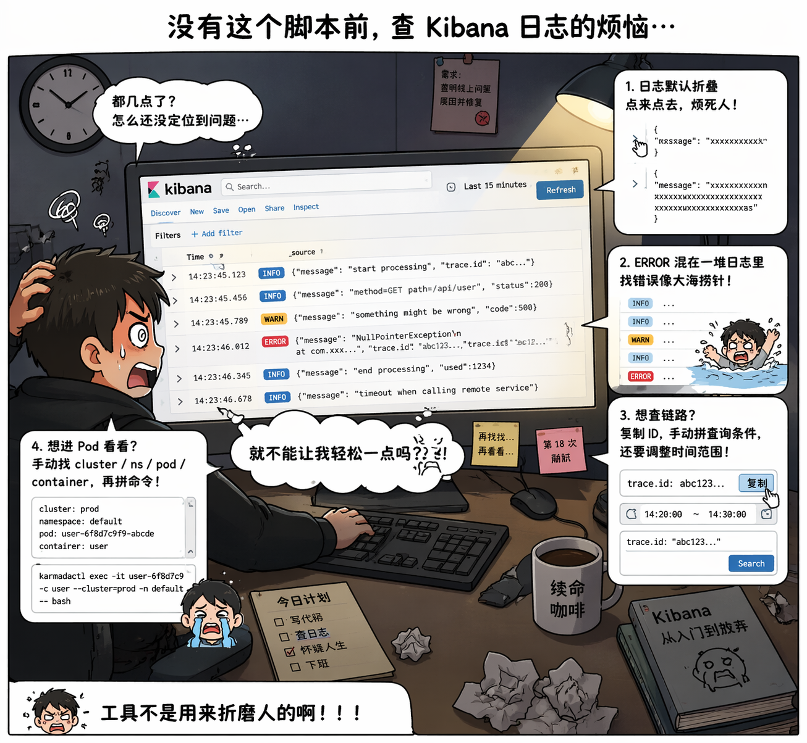
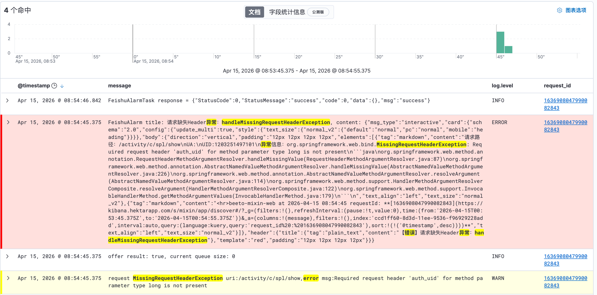

# 抱一丝哈，我说——你的 Kibana 抱用 🤏

> Kibana 原生体验：
> 「点一下展开 → 再点一下 → 再点一下 → 好，我不看了」


这个脚本的目标很简单：
👉 让你少点几下
👉 少瞎几次
👉 少怀疑人生一点点

---

## 🧠 这玩意儿到底是干嘛的？

一个 **Kibana 增强用户脚本**（油猴插件），专门解决这些经典痛点：

* 日志折叠得像压缩包（还不给你解压）
* ERROR 混在 INFO 里，像在玩“大家来找茬”
* trace.id 明明在，但你还得手敲查询
* 查链路像考古

👉 总结一句：**把 Kibana 从“工具”改造成“稍微像人用的工具”**

---

## ✨ 功能一览

### 🔍 自动展开日志

不用点了，真的不用点了。

* 自动展开所有日志
* 大段 message 一次性看完
* 适合：懒人 / 忙人 / 正常人

---

### 🎨 智能高亮

#### 日志级别：

* ERROR → 红得很诚实
* WARN → 黄得很焦虑

#### 错误内容：

* 默认抓：`error / exception`
* 支持自定义关键词（甚至 regex）
* 高亮：又黄又粗（字体）

👉 终于不用在一堆 JSON 里找“出事了在哪”

---

### 🔗 点击 ID 自动跳链路（真·生产力）

支持字段：

* `trace.id`
* `request_id`

点一下会发生什么？

* 自动生成时间范围（±35 秒）
* 自动拼 Kuery
* 自动打开新 tab
* 自动清空 filters（防止你被坑）
* 自动带上正确 index（这点很关键）

👉 你以为你在点 ID，其实是在召唤完整链路 👀

---

### 🚀 Karmada 命令一键复制

在日志详情里：

👉 自动出现按钮
👉 点一下直接复制命令

自动解析：

* cluster
* namespace
* pod
* container

生成：

```bash
karmadactl exec -it xxx -c xxx --cluster=xxx -n xxx -- bash
```

👉 从“看日志”到“进容器”——一步到位

---

### ⚡ 实时响应（不是刷新流）

* DOM 变化自动处理
* URL 变化自动重置
* 列变化自动重算

👉 你操作 Kibana，它在背后偷偷给你擦屁股

---

## 🧩 安装（不搞花里胡哨）

### 前置：

* 浏览器（别用 IE，求你了）
* Tampermonkey / Greasemonkey

### 安装方式：

**方式一（推荐）：**
👉 点一下安装脚本

**方式二（手动）：**

1. 打开油猴
2. 新建脚本
3. 粘贴 `kibana-helper.user.js`
4. 保存
5. 刷新 Kibana

👉 完事

---

## 🧪 使用方式（几乎不用学）

装完之后：

* 打开 Kibana
* 什么都不用干

你会看到：

* 日志自动展开
* ERROR 自动跳脸
* ID 变蓝可点
* 右下角 ⚙️

👉 是的，它就是这么“没存在感但很有用”。使用效果如下


---

## ⚙️ 可配置项（给折腾的人）

### 🔧 错误关键词

点 ⚙️ → 自定义：

```
error
exception
timeout
connection refused
```

* 不区分大小写
* 支持正则
* 本地永久保存

---

### 🎨 样式自定义

你要是对颜色有执念：

```js
.log-level-error { ... }
.error-highlight { ... }
```

👉 想搞成赛博朋克也没人拦你

---

### ⏱️ 时间范围

默认 ±35 秒：

```js
timestamp ± 35000ms
```

👉 如果你们系统“慢得优雅”，可以调大一点

---

## 🐛 常见问题

### Q：脚本没生效？

* 看油猴有没有开
* 刷新页面
* 打开 console 看报错

---
---

### Q：点 ID 查不到？

可能原因：

* 时间范围不够
* 字段名不匹配
* index 错

👉 调参数即可

---

### Q：Karmada 按钮不见了？

检查：

* 有没有 `cluster`
* 有没有 `service.node.name`
* 格式对不对

---

## 📈 为什么你会想一直用它？

因为你会逐渐忘记：

👉 Kibana 原来是这么难用的 😅

---

## 🧾 License

MIT —— 想怎么用就怎么用

---

## ❤️ 最后一句

如果它帮你少骂了一次 Kibana，
那就值了。
